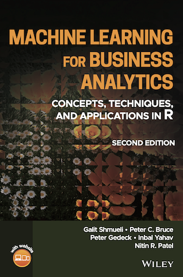

<table>
<tr>
<td style="border:0"></td>
<td style="border:0">
<h1>Machine Learning for Business Analytics<br>
<small>Concepts, Techniques, and Applications in R</small></h1>

by Galit Shmueli, Peter C. Bruce, Peter Gedeck, Inbal Yahav, Nitin R. Patel

Publisher: Wiley; 2nd edition (February, 2023)
ISBN: 978-1-118-83517-2
Preorder on 
<a href="https://www.wiley.com/en-us/Machine+Learning+for+Business+Analytics%3A+Concepts%2C+Techniques%2C+and+Applications+in+R%2C+2nd+Edition-p-9781119835172">Wiley</a>

<!-- Errata: http://oreilly.com/catalog/errata.csp?isbn=9781492072942 -->
</td>
</tr>
</table>

# Description
Machine learning —also known as data mining or data analytics— is a fundamental part of data science. It is used by organizations in a wide variety of arenas to turn raw data into actionable information.

Machine Learning for Business Analytics: Concepts, Techniques, and Applications in R provides a comprehensive introduction and an overview of this methodology. This best-selling textbook covers both statistical and machine learning algorithms for prediction, classification, visualization, dimension reduction, rule mining, recommendations, clustering, text mining, experimentation and network analytics. Along with hands-on exercises and real-life case studies, it also discusses managerial and ethical issues for responsible use of machine learning techniques.

# Source code and instructors material
To access the source code of chapters and to find instructors material go to [www.dataminingbook.com](https://www.dataminingbook.com/book/r-2nd-edition-2022). 

# Code and data repository
This repository contains datasets used in this book 

# Installation of R packages used in the book
Most packages can be installed directly from CRAN. 

## MLBA
The source code and datasets of this repository are available in the `mlba` package. You can install this package using the following commands:
```
if (!require(mlba)) {
  library(devtools)
  install_github("gedeck/mlba/mlba", force=TRUE)
}
```
Note that this requires the installation of the `devtools` package

## DiscriMiner
The `DiscriMiner` package is currently not available from CRAN. You can install it directly from Github as described in https://github.com/gastonstat/DiscriMiner
```
if (!require(DiscriMiner)) {
    library(devtools)
    install_github('DiscriMiner’, username='gastonstat')
}
```

